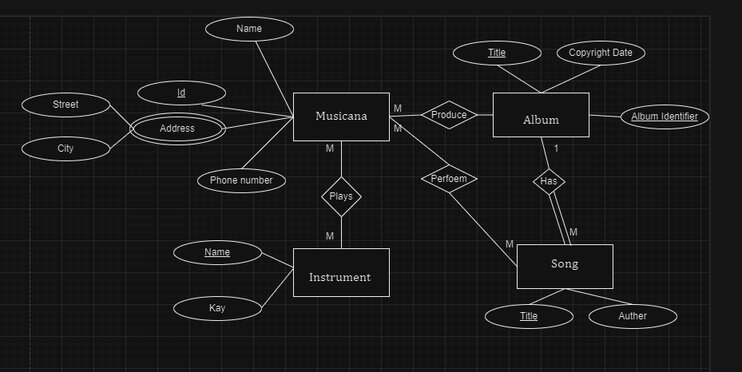

# Remove test branch

`git branch -D test`

# Remove test branch remotly

`git push origin --delete  test`

# Delete loacl dev

`git branch -D dev`

# Remove test branch remotly

`git push origin --delete branch-name`

# checkout another branch withut commit chacnges

`git stash`
`git checkout dev`
`git stash pop`

# list tag

`git tag`

# delete tag

`git tag -d v1.7`

# image

